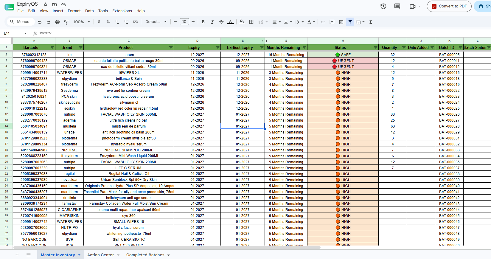
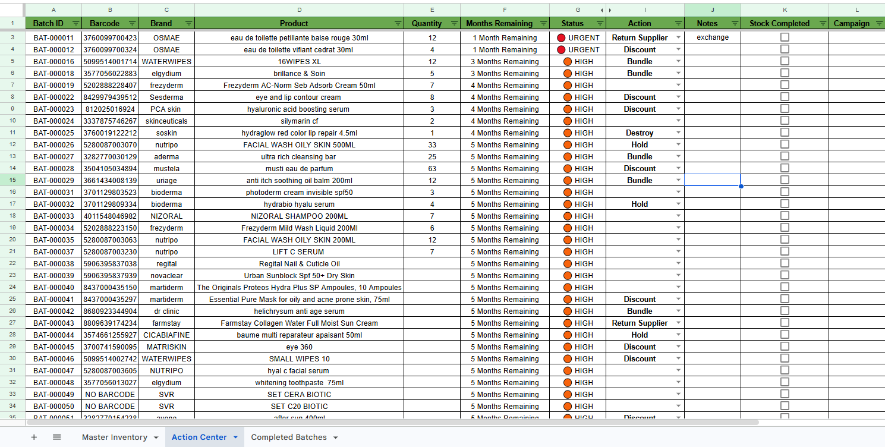
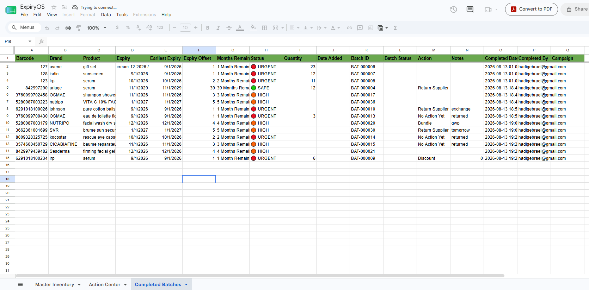

# ExpiryOS

[](LICENSE)
[](CHANGELOG.md)

A lightweight, formula-first inventory expiry management system built with **Google Sheets** and **Google Apps Script**.

ExpiryOS helps warehouses and small businesses track inventory batches, monitor product expiry dates, and prioritize stock before it expires — without the cost or complexity of a full ERP system.

---

## Table of Contents

- [Why ExpiryOS](#why-expiryos)
- [Key Features](#key-features)
- [Screenshots](#screenshots)
- [Architecture](#architecture)
- [Tech Stack](#tech-stack)
- [Project Structure](#project-structure)
- [Installation & Setup](#installation--setup)
- [Testing](#testing)
- [Releases](#releases)
- [Roadmap](#roadmap)
- [Documentation](#documentation)
- [License](#license)

---

## Why ExpiryOS

Most small and medium businesses already track inventory in a spreadsheet — but that spreadsheet rarely gives warehouse and marketing teams an efficient way to manage expiry dates. Warehouse staff know what arrived; marketing knows what should be promoted or discounted. There's usually no simple, shared workflow connecting the two.

ExpiryOS closes that gap by combining the flexibility of Google Sheets with just enough Google Apps Script automation to make expiry tracking reliable at scale, while staying fast, transparent, and easy for a non-developer to maintain.

The project is built around a few consistent principles:

- **Formula-first** — native Sheets formulas over Apps Script wherever they can do the job
- **Modular architecture** — each file owns one responsibility
- **Header-driven design** — columns are resolved by name, never hardcoded position
- **Real-world warehouse workflows** — designed around how batches actually get received, tracked, and cleared

See `docs/PRD.md` for the full product requirements and long-term vision behind the project.

---

## Key Features

### 📦 Master Inventory Foundation

- Automatic, permanent, sequential Batch ID generation — safe under concurrent edits via `LockService`
- Barcode-based product recognition (Brand/Product auto-fill from the highest Batch ID on record)
- Duplicate batch detection (Barcode + Expiry, or Product + Expiry for `NO BARCODE` items), with a confirm-or-cancel prompt
- `NO BARCODE` product support
- Dynamic, header-based column resolution and multi-row paste support

### 📅 Expiry Intelligence Engine

- Single- and multi-expiry parsing in one cell (e.g. gift sets with several components, each on its own expiry)
- Automatic extraction of the earliest expiry date per batch
- Human-readable shelf-life text:

  ```
  16 Months Remaining
  1 Month Remaining
  Expires This Month
  5 Months Expired
  ```

- Automatic priority classification with conditional formatting:

  ```
  🔴 EXPIRED   🔴 URGENT   🟠 HIGH   🟡 MEDIUM   🟢 SAFE
  ```

### 📋 Action Center

- Automatically generated, formula-driven view of every batch at 12 months remaining or less (or already expired) — mirrored live from Master Inventory, never a second copy of the data
- Editable **Action** (dropdown), **Notes** (free text), and **Stock Completed** (checkbox) columns
- Checking **Stock Completed** archives the batch to a permanent **Completed Batches** sheet — recording who completed it and exactly when — and removes it from the active workflow automatically
- Supports user-added business columns (e.g. a `Campaign` column) with zero code changes

---

## Screenshots

**Master Inventory** — batches with automatic Batch IDs, expiry parsing, and status classification.



**Action Center** — the filtered, actionable view marketing works from, with Action/Notes/Stock Completed controls.



**Completed Batches** — the permanent archive created automatically when a batch is marked complete.



> The columns beyond the core schema in these screenshots (e.g. `Date Added`, `Batch Status`, `Campaign`) are user-added business columns — ExpiryOS carries them through automatically without any code changes.

---

## Architecture

ExpiryOS follows a modular architecture where each file has a single responsibility, and business logic is calculated once and reused everywhere downstream — nothing re-parses or re-derives a value another module already computed.

```
Master Inventory (source of truth)
        │
        ▼
     Expiry
        │
        ▼
Earliest Expiry
        │
        ▼
  Expiry Offset
      ├──────────────┐
      ▼              ▼
Months Remaining   Status
        │              │
        └──────┬───────┘
               ▼
        Action Center (mirrored, filtered ≤ 12 months)
               │
               ▼
        Completed Batches (Archive)
```

Master Inventory is the only place active batch data lives. Action Center mirrors it through per-column formulas rather than holding a second copy, so its rows never drift out of alignment. Archiving a batch snapshots it permanently and removes it from the active workflow.

For the full design — including every module's responsibilities, the data model, and the reasoning behind the no-duplication approach — see `docs/ARCHITECTURE.md`. For the detailed, as-built design of Action Center and the Archive workflow specifically (row-alignment guarantees, edge cases, and every bug found and fixed while building it), see `docs/MILESTONE_3_ARCHITECTURE.md`.

---

## Tech Stack

- Google Sheets
- Google Apps Script (V8 runtime)
- JavaScript (ES6)
- [clasp](https://github.com/google/clasp) (Google's Apps Script CLI)
- Git / GitHub
- Visual Studio Code

---

## Project Structure

```text
ExpiryOS/
├── src/
│   ├── appsscript.json           Apps Script manifest
│   ├── Config.js                 Sheet names, headers, thresholds — single source of config
│   ├── Helpers.js                Shared, sheet-agnostic utility functions
│   ├── Main.js                   onOpen/onEdit trigger entry points (wiring only)
│   ├── InventoryService.js       Batch ID generation
│   ├── ProductService.js         Barcode-based product recognition
│   ├── DuplicateDetectionService.js   Duplicate batch warning
│   ├── ExpiryEngine.js           Multi-expiry parsing, EXPIRY_EARLIEST() custom function
│   ├── StatusEngine.js           Expiry Offset / Months Remaining / Status formulas
│   ├── SheetFormatting.js        Cosmetic sheet setup (freeze row, alignment)
│   ├── ActionCenterService.js    Action Center mirror formulas, Filter, validation
│   └── ArchiveService.js         Stock Completed / Completed Batches workflow
│
├── docs/
│   ├── PRD.md                    Product requirements and vision
│   ├── ARCHITECTURE.md           System-wide architecture
│   ├── MILESTONE_1.md            Master Inventory Foundation — completion summary
│   ├── MILESTONE_1_TEST_PLAN.md
│   ├── MILESTONE_2.md            Expiry Intelligence Engine — completion summary
│   ├── MILESTONE_2_TEST_PLAN.md
│   ├── MILESTONE_3.md            Action Center — completion summary
│   ├── MILESTONE_3_ARCHITECTURE.md   Action Center / Archive as-built design
│   └── MILESTONE_3_TEST_PLAN.md
│
├── assets/                       Screenshots used in this README
├── demo-data/                    Reserved for sample/demo data
│
├── CHANGELOG.md
├── ROADMAP.md
├── LICENSE
└── README.md
```

---

## Installation & Setup

ExpiryOS is a Google Sheets–bound Apps Script project — the code runs against a specific spreadsheet, so setup involves both the sheet and the script.

1. **Create a Google Sheet** and rename its first tab to `Master Inventory`. Add a header row (row 1) with at least:

   ```
   Batch ID | Barcode | Brand | Product | Expiry
   ```

   (`Quantity` and every derived column are added automatically by the setup functions below.)

2. **Open the bound Apps Script project**: in the sheet, go to `Extensions > Apps Script`. Note its Script ID from `Project Settings`.

3. **Clone this repository** and install [clasp](https://github.com/google/clasp):

   ```bash
   git clone https://github.com/hadi-gb/expiry-os.git
   cd expiry-os
   npm install -g @google/clasp
   clasp login
   ```

4. **Point clasp at your sheet's script.** Create a `.clasp.json` in the repo root (this file is intentionally gitignored, since the Script ID is specific to your own sheet):

   ```json
   {
     "scriptId": "<your Script ID from step 2>",
     "rootDir": "src"
   }
   ```

5. **Push the code:**

   ```bash
   clasp push
   ```

6. **Run the one-time setup utilities** from the Apps Script editor, in this order:

   ```javascript
   setupEarliestExpiryColumn();
   setupStatusColumns();
   setupSheetFormatting();
   setupActionCenter();
   setupCompletedBatches();
   ```

   Each is idempotent and safe to re-run — they resolve every column by header name and never overwrite a manually entered value or unrelated formula.

7. **Reload the spreadsheet.** Master Inventory, Action Center, and Completed Batches are now fully wired up.

---

## Testing

ExpiryOS has no automated test suite — as a formula-heavy Apps Script project bound to a live spreadsheet, its test plans are manual, scenario-based, and run directly against a real sheet. Each completed milestone has a dedicated production test plan documenting every case exercised (including edge cases and the real bugs they caught):

- `docs/MILESTONE_1_TEST_PLAN.md` — Batch ID, Product Recognition, Duplicate Detection
- `docs/MILESTONE_2_TEST_PLAN.md` — Expiry parsing, Earliest Expiry, Status Engine
- `docs/MILESTONE_3_TEST_PLAN.md` — Action Center, Archive workflow, regression findings

---

## Releases

ExpiryOS follows [Semantic Versioning](https://semver.org/). Full history in `CHANGELOG.md`.

| Version | Date | Highlights |
|---|---|---|
| [v0.3.0](https://github.com/hadi-gb/expiry-os/tree/v0.3.0) | 2026-08-13 | Action Center + Completed Batches archive workflow |
| [v0.2.0](https://github.com/hadi-gb/expiry-os/tree/v0.2.0) | 2026-08-09 | Expiry Intelligence Engine (multi-expiry parsing, Status Engine) |
| [v0.1.0](https://github.com/hadi-gb/expiry-os/tree/v0.1.0) | 2026-08-08 | Master Inventory Foundation |

---

## Roadmap

| Milestone | Status |
|---|---|
| Master Inventory Foundation | ✅ Complete |
| Expiry Intelligence Engine | ✅ Complete |
| Action Center | ✅ Complete |
| Dashboard & Analytics | ⏳ Planned |
| Product Definition Management | ⏳ Planned |

Also planned: automatic sort-by-nearest-expiry in Action Center, evaluated during Milestone 3 and deliberately deferred to keep that release's scope to what was implemented and tested (see `docs/MILESTONE_3_ARCHITECTURE.md` Section 2).

Full detail in `ROADMAP.md`.

---

## Documentation

| Document | Purpose |
|---|---|
| `docs/PRD.md` | Product requirements and long-term vision |
| `docs/ARCHITECTURE.md` | System-wide architecture and data model |
| `docs/MILESTONE_*.md` | Per-milestone completion summaries |
| `docs/MILESTONE_3_ARCHITECTURE.md` | As-built design deep-dive: Action Center + Archive |
| `docs/MILESTONE_*_TEST_PLAN.md` | Manual production test plans |
| `CHANGELOG.md` | Complete release history |
| `ROADMAP.md` | Planned milestones |

---

## License

Licensed under the [MIT License](LICENSE).
